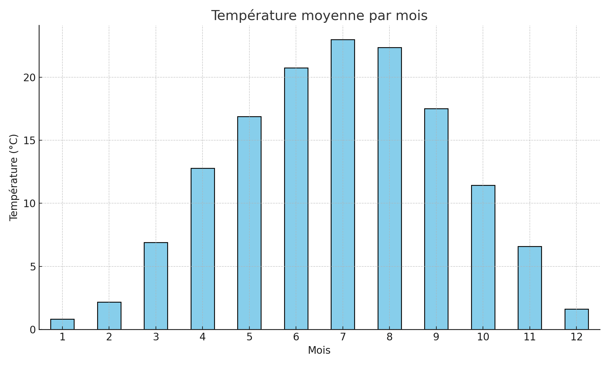

TP3 - Traitement Fonctionnel de Données (Météo)
===============================================

Objectif
-----------
Analyser des données météorologiques historiques avec Python en appliquant les concepts de la
programmation fonctionnelle (fonctions pures, map/filter, immutabilité...).

Données utilisées
---------------------
Fichier : weatherHistory.csv
Colonnes : Date, Température, Humidité, Vent, Type de précipitation, etc.

Pipeline fonctionnel
------------------------
1. Chargement des données avec pandas.read_csv()
2. Nettoyage (suppression des lignes vides)
3. Transformation : extraction du mois depuis la date
4. Statistiques : température moyenne par mois
5. Visualisation : graphique des températures avec matplotlib

Exemple de pipeline fonctionnel
----------------------------------
def process_weather_data(filepath):
    return pipe(
        filepath,
        load_data,
        clean_data,
        extract_month
    )

Résultats obtenus
---------------------
- Moyenne des températures calculée pour chaque mois (de janvier à décembre)
- Visualisation claire avec un graphique en barres
- Mois les plus chauds : juillet, août
- Mois les plus froids : janvier, décembre

Exécution du code
---------------------
1. Installer les dépendances :
   pip install pandas matplotlib toolz

2. Exécuter le fichier principal :
   python src/main.py

Technologies utilisées
--------------------------
- Python 3.x
- pandas
- matplotlib
- toolz (pour la programmation fonctionnelle)

